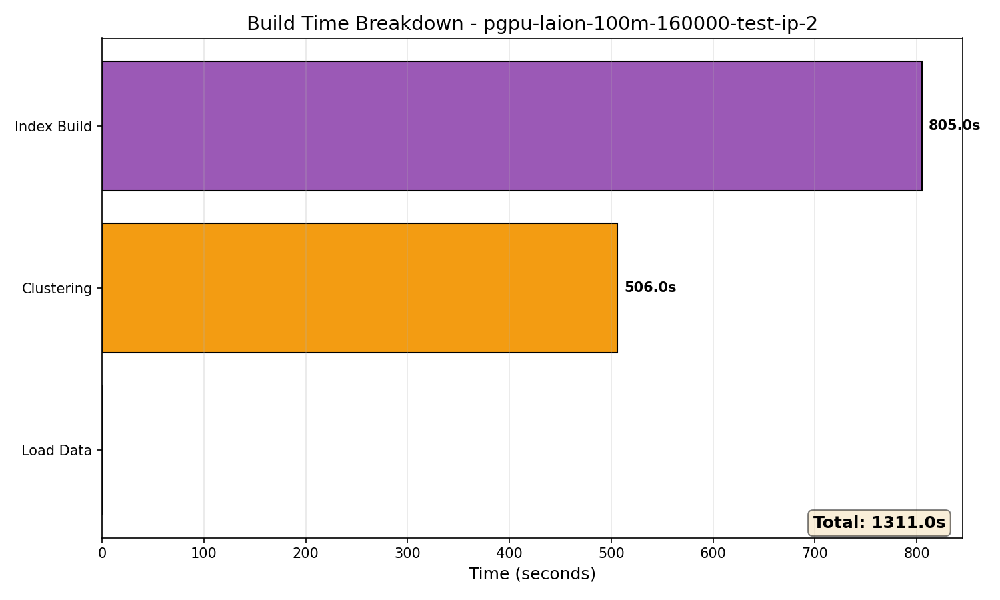
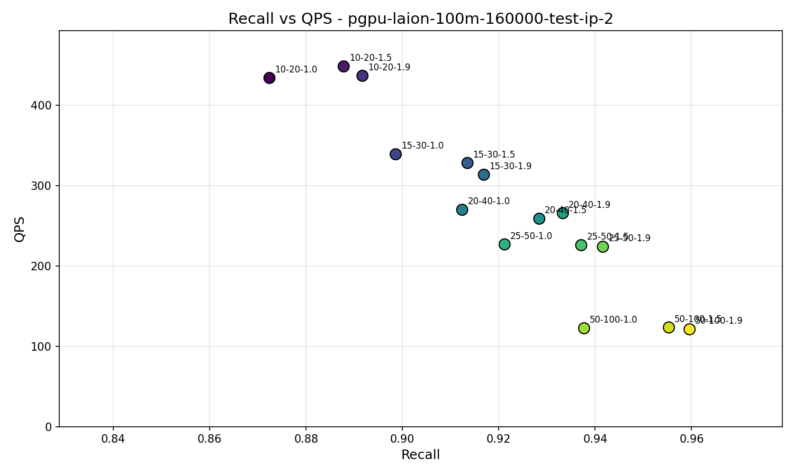
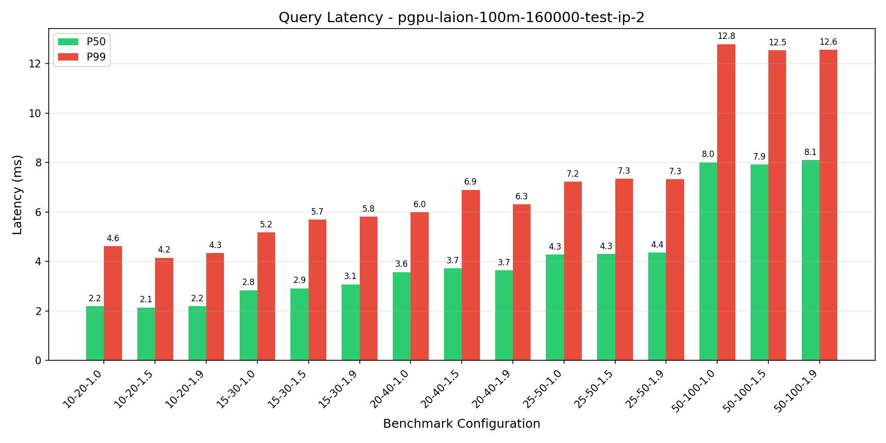
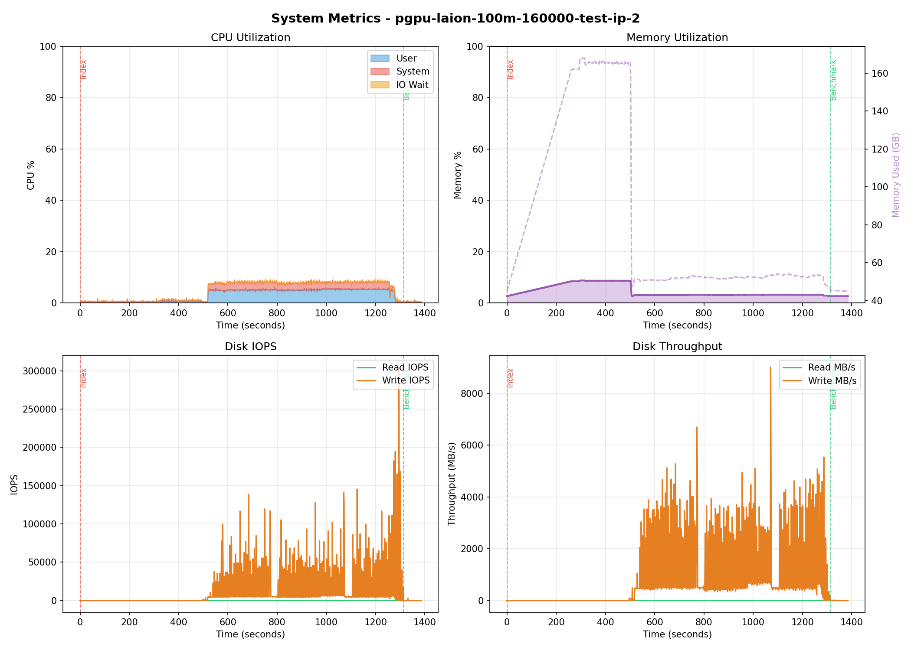

# Benchmark Report: pgpu-laion-100m-160000-test-ip-2

**Generated:** 2026-01-29 14:34:38
**Host:** hot-ready-ubuntu-rxt6000-1-dtpm-gpu01
**Suite Type:** pgpu

---

## Configuration

| Parameter             | Value              |
|-----------------------|--------------------|
| Dataset               | laion-100m-test-ip |
| Metric                | dot                |
| PG Parallel Workers   | 32                 |
| Query Clients         | 1                  |
| Top-K                 | 10                 |
| Lists                 | [400, 160000]      |
| Sampling Factor       | 256                |
| Residual Quantization | True               |

---

## Build Metrics

| Metric           | Value   |
|------------------|---------|
| Load Time        | N/As    |
| Clustering Time  | 505.99s |
| Index Build Time | 1311s   |
| Index Size       | 400 GB  |

---

## Benchmark Results

| nprob  | epsilon | Recall | QPS    | P50 (ms) | P99 (ms) |
|--------|---------|--------|--------|----------|----------|
| 10,20  | 1.0     | 0.8724 | 433.95 | 2.19     | 4.62     |
| 10,20  | 1.5     | 0.8878 | 448.29 | 2.14     | 4.15     |
| 10,20  | 1.9     | 0.8917 | 436.64 | 2.20     | 4.34     |
| 15,30  | 1.0     | 0.8986 | 338.95 | 2.84     | 5.18     |
| 15,30  | 1.5     | 0.9135 | 328.10 | 2.92     | 5.69     |
| 15,30  | 1.9     | 0.9169 | 313.52 | 3.08     | 5.81     |
| 20,40  | 1.0     | 0.9124 | 269.87 | 3.57     | 5.99     |
| 20,40  | 1.5     | 0.9284 | 258.78 | 3.72     | 6.90     |
| 20,40  | 1.9     | 0.9333 | 265.68 | 3.65     | 6.31     |
| 25,50  | 1.0     | 0.9212 | 226.78 | 4.28     | 7.23     |
| 25,50  | 1.5     | 0.9371 | 225.82 | 4.31     | 7.35     |
| 25,50  | 1.9     | 0.9416 | 223.85 | 4.36     | 7.32     |
| 50,100 | 1.0     | 0.9377 | 122.41 | 8.01     | 12.79    |
| 50,100 | 1.5     | 0.9553 | 123.43 | 7.93     | 12.53    |
| 50,100 | 1.9     | 0.9596 | 121.09 | 8.10     | 12.55    |

---

## Charts

### Recall vs QPS

### Query Latency

---

## System Metrics

**Monitoring Duration:** 1384.3 seconds

### CPU

| Metric  | Value |
|---------|-------|
| Average | 4.8%  |
| Maximum | 9.3%  |

### Memory

| Metric  | Value           |
|---------|-----------------|
| Average | 4.5%            |
| Maximum | 8.8% (167.9 GB) |

### Disk IO

| Metric                | Read | Write  |
|-----------------------|------|--------|
| IOPS (avg)            | 0    | 9949   |
| IOPS (max)            | 9    | 304877 |
| Throughput avg (MB/s) | 0.0  | 607.6  |
| Throughput max (MB/s) | 0.0  | 9010.5 |

---

## PostgreSQL Configuration

Settings modified from defaults:

| Setting                          | Value          | Default                        | Source             |
|----------------------------------|----------------|--------------------------------|--------------------|
| autovacuum                       | off            | on                             | configuration file |
| shared_preload_libraries         | vchord         |                                | configuration file |
| client_min_messages              | debug1         | notice                         | configuration file |
| max_connections                  | 200            | 100                            | configuration file |
| jit                              | off            | on                             | configuration file |
| random_page_cost                 | 1.1            | 4                              | configuration file |
| log_filename                     | postgresql.log | postgresql-%Y-%m-%d_%H%M%S.log | configuration file |
| log_rotation_age                 | 0min           | 1440min                        | configuration file |
| logging_collector                | on             | off                            | configuration file |
| effective_io_concurrency         | 200            | 1                              | configuration file |
| max_parallel_maintenance_workers | 64             | 2                              | configuration file |
| max_parallel_workers             | 64             | 8                              | configuration file |
| max_worker_processes             | 64             | 8                              | configuration file |
| max_files_per_process            | 16384          | 1000                           | configuration file |
| max_wal_size                     | 307200MB       | 1024MB                         | configuration file |

## PostgreSQL Statistics

### Final State (after_benchmark)

| Metric                       | Value          |
|------------------------------|----------------|
| Cache Hit Ratio              | 85.14%         |
| Blocks Read                  | 6,824,643,192  |
| Blocks Hit                   | 39,111,511,951 |
| Temp Files                   | 0              |
| Deadlocks                    | 0              |
| Checkpoints (timed)          | 842            |
| Checkpoints (requested)      | 69             |
| Buffers Written (checkpoint) | 593,346        |

### Activity by Phase

| Phase                         | Blocks Read | Blocks Hit    | Transactions | Checkpoints |
|-------------------------------|-------------|---------------|--------------|-------------|
| Data Loading + Index Building | 260,716,166 | 1,904,235,494 | 2,730        | 5           |
| Query Benchmark               | 17,754,314  | 4,122,909     | 15,166       | 0           |

### Total Changes

| Metric                | Value         |
|-----------------------|---------------|
| Blocks Read           | 278,470,480   |
| Blocks Hit            | 1,908,358,403 |
| Transactions          | 17,896        |
| Rows Inserted         | 481,250       |
| Checkpoints           | 5             |
| Checkpoint Write Time | 751,571 ms    |
