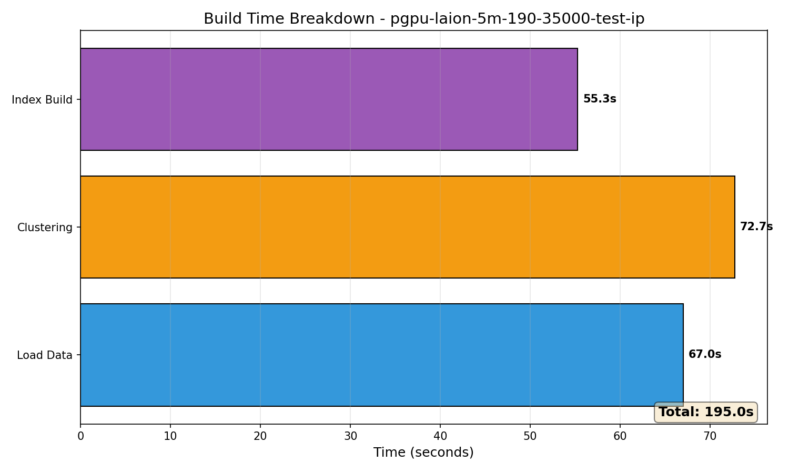
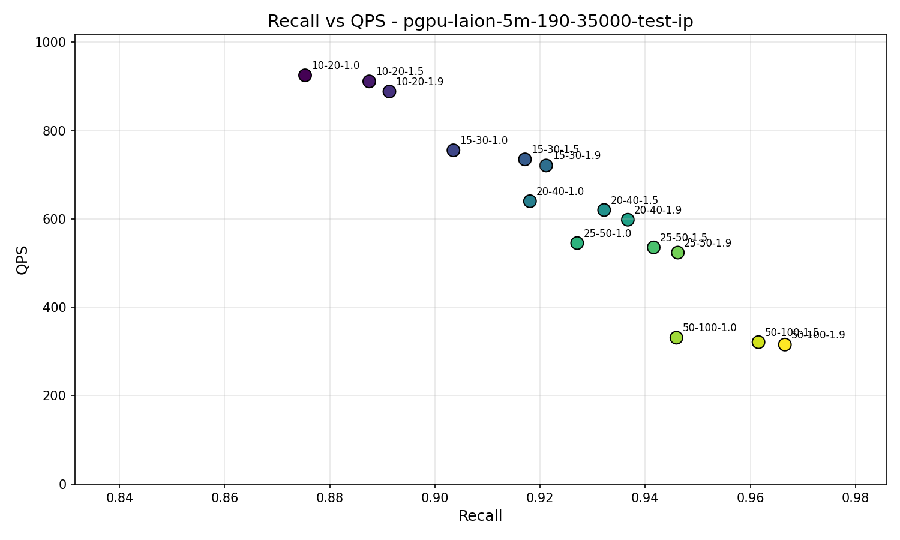
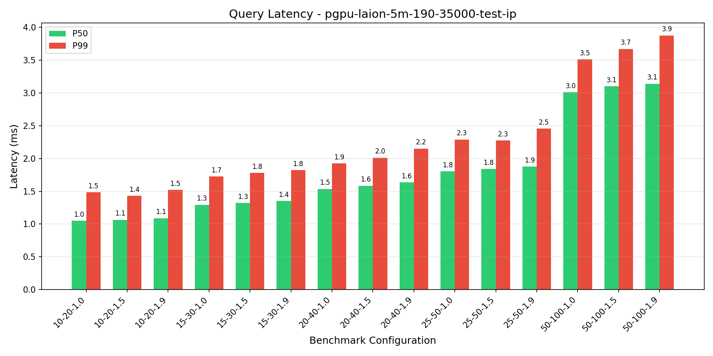
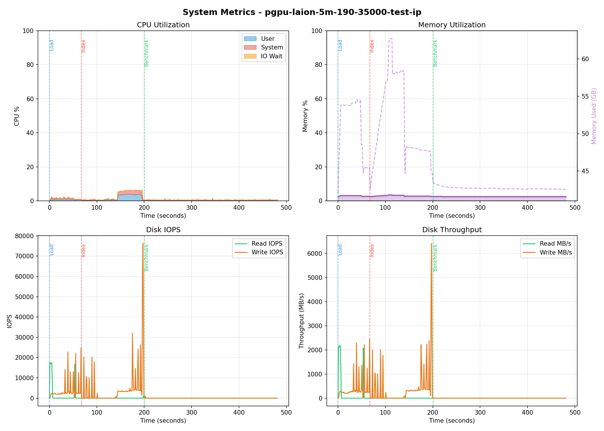

# Benchmark Report: pgpu-laion-5m-190-35000-test-ip

**Generated:** 2026-01-29 13:41:30
**Host:** hot-ready-ubuntu-rxt6000-1-dtpm-gpu01
**Suite Type:** pgpu

---

## Configuration

| Parameter             | Value            |
|-----------------------|------------------|
| Dataset               | laion-5m-test-ip |
| Metric                | dot              |
| PG Parallel Workers   | 32               |
| Query Clients         | 1                |
| Top-K                 | 10               |
| Lists                 | [190, 35000]     |
| Sampling Factor       | 256              |
| Residual Quantization | True             |

---

## Build Metrics

| Metric           | Value  |
|------------------|--------|
| Load Time        | 67s    |
| Clustering Time  | 72.73s |
| Index Build Time | 128s   |
| Index Size       | 21 GB  |

---

## Benchmark Results

| nprob  | epsilon | Recall | QPS    | P50 (ms) | P99 (ms) |
|--------|---------|--------|--------|----------|----------|
| 10,20  | 1.0     | 0.8753 | 924.94 | 1.05     | 1.48     |
| 10,20  | 1.5     | 0.8875 | 911.23 | 1.07     | 1.43     |
| 10,20  | 1.9     | 0.8913 | 888.37 | 1.09     | 1.52     |
| 15,30  | 1.0     | 0.9035 | 755.18 | 1.30     | 1.73     |
| 15,30  | 1.5     | 0.9171 | 734.77 | 1.32     | 1.78     |
| 15,30  | 1.9     | 0.9212 | 720.88 | 1.35     | 1.82     |
| 20,40  | 1.0     | 0.9181 | 640.01 | 1.54     | 1.93     |
| 20,40  | 1.5     | 0.9322 | 620.13 | 1.58     | 2.01     |
| 20,40  | 1.9     | 0.9367 | 598.10 | 1.64     | 2.15     |
| 25,50  | 1.0     | 0.9271 | 545.31 | 1.80     | 2.29     |
| 25,50  | 1.5     | 0.9416 | 535.48 | 1.84     | 2.27     |
| 25,50  | 1.9     | 0.9462 | 523.73 | 1.87     | 2.45     |
| 50,100 | 1.0     | 0.9459 | 331.02 | 3.01     | 3.51     |
| 50,100 | 1.5     | 0.9616 | 321.04 | 3.10     | 3.67     |
| 50,100 | 1.9     | 0.9666 | 315.51 | 3.14     | 3.87     |

---

## Charts

### Recall vs QPS

### Query Latency

---

## System Metrics

**Monitoring Duration:** 480.9 seconds

### CPU

| Metric  | Value |
|---------|-------|
| Average | 1.5%  |
| Maximum | 6.8%  |

### Memory

| Metric  | Value          |
|---------|----------------|
| Average | 2.7%           |
| Maximum | 3.5% (62.7 GB) |

### Disk IO

| Metric                | Read   | Write  |
|-----------------------|--------|--------|
| IOPS (avg)            | 253    | 1711   |
| IOPS (max)            | 17593  | 76256  |
| Throughput avg (MB/s) | 30.8   | 158.2  |
| Throughput max (MB/s) | 2174.7 | 6418.6 |

---

## PostgreSQL Configuration

Settings modified from defaults:

| Setting                          | Value          | Default                        | Source             |
|----------------------------------|----------------|--------------------------------|--------------------|
| autovacuum                       | off            | on                             | configuration file |
| shared_preload_libraries         | vchord         |                                | configuration file |
| client_min_messages              | debug1         | notice                         | configuration file |
| max_connections                  | 200            | 100                            | configuration file |
| jit                              | off            | on                             | configuration file |
| random_page_cost                 | 1.1            | 4                              | configuration file |
| log_filename                     | postgresql.log | postgresql-%Y-%m-%d_%H%M%S.log | configuration file |
| log_rotation_age                 | 0min           | 1440min                        | configuration file |
| logging_collector                | on             | off                            | configuration file |
| effective_io_concurrency         | 200            | 1                              | configuration file |
| max_parallel_maintenance_workers | 64             | 2                              | configuration file |
| max_parallel_workers             | 64             | 8                              | configuration file |
| max_worker_processes             | 64             | 8                              | configuration file |
| max_files_per_process            | 16384          | 1000                           | configuration file |
| max_wal_size                     | 307200MB       | 1024MB                         | configuration file |

## PostgreSQL Statistics

### Final State (after_benchmark)

| Metric                       | Value          |
|------------------------------|----------------|
| Cache Hit Ratio              | 84.92%         |
| Blocks Read                  | 6,267,687,511  |
| Blocks Hit                   | 35,294,852,647 |
| Temp Files                   | 0              |
| Deadlocks                    | 0              |
| Checkpoints (timed)          | 832            |
| Checkpoints (requested)      | 67             |
| Buffers Written (checkpoint) | 568,682        |

### Activity by Phase

| Phase           | Blocks Read | Blocks Hit  | Transactions | Checkpoints |
|-----------------|-------------|-------------|--------------|-------------|
| Index Building  | 12,462,753  | 100,035,087 | 369          | 1           |
| Query Benchmark | 68,280,473  | 34,489,048  | 150,166      | 0           |

### Total Changes

| Metric                | Value       |
|-----------------------|-------------|
| Blocks Read           | 80,743,226  |
| Blocks Hit            | 134,524,135 |
| Transactions          | 150,535     |
| Rows Inserted         | 105,611     |
| Checkpoints           | 1           |
| Checkpoint Write Time | 181 ms      |
