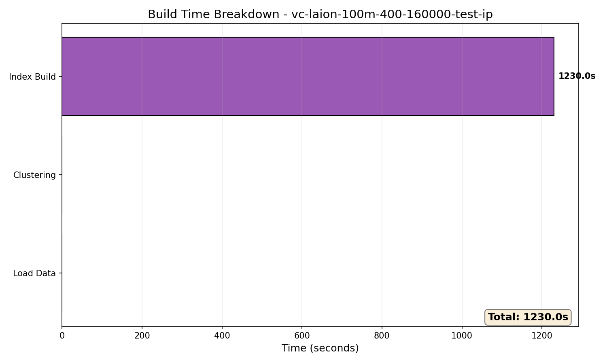
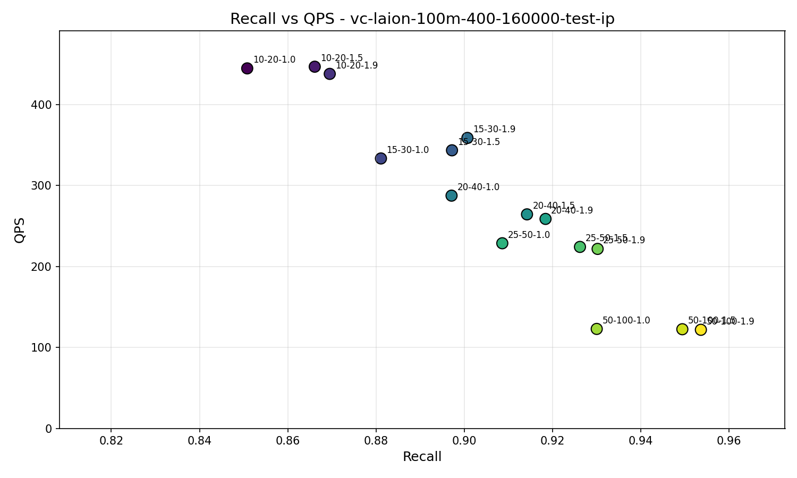
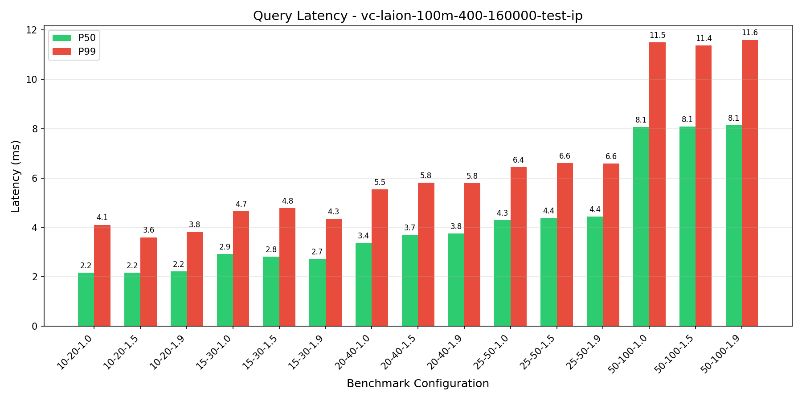
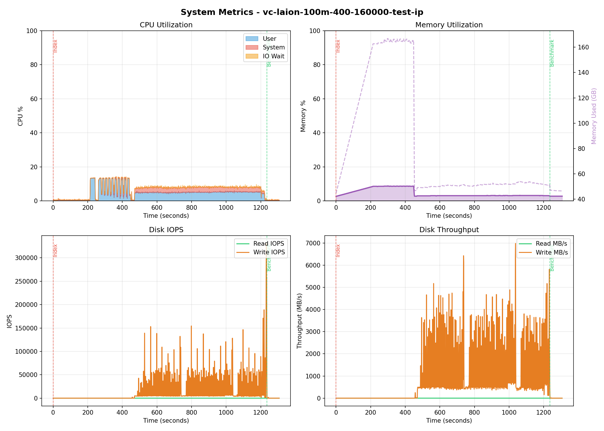

# Benchmark Report: vc-laion-100m-400-160000-test-ip

**Generated:** 2026-01-29 14:57:27
**Host:** hot-ready-ubuntu-rxt6000-1-dtpm-gpu01
**Suite Type:** vectorchord

---

## Configuration

| Parameter             | Value              |
|-----------------------|--------------------|
| Dataset               | laion-100m-test-ip |
| Metric                | dot                |
| PG Parallel Workers   | 32                 |
| Query Clients         | 1                  |
| Top-K                 | 10                 |
| Lists                 | [400, 160000]      |
| Sampling Factor       | 256                |
| Residual Quantization | True               |
| Build Threads         | 32                 |
| K-means Hierarchical  | True               |

---

## Build Metrics

| Metric           | Value  |
|------------------|--------|
| Load Time        | N/As   |
| Index Build Time | 1230s  |
| Index Size       | 400 GB |

---

## Benchmark Results

| nprob  | epsilon | Recall | QPS    | P50 (ms) | P99 (ms) |
|--------|---------|--------|--------|----------|----------|
| 10,20  | 1.0     | 0.8508 | 444.45 | 2.17     | 4.11     |
| 10,20  | 1.5     | 0.8661 | 446.51 | 2.17     | 3.60     |
| 10,20  | 1.9     | 0.8695 | 437.66 | 2.22     | 3.82     |
| 15,30  | 1.0     | 0.8811 | 333.25 | 2.92     | 4.66     |
| 15,30  | 1.5     | 0.8972 | 343.31 | 2.82     | 4.78     |
| 15,30  | 1.9     | 0.9007 | 358.58 | 2.73     | 4.35     |
| 20,40  | 1.0     | 0.8971 | 287.33 | 3.37     | 5.55     |
| 20,40  | 1.5     | 0.9142 | 264.23 | 3.70     | 5.80     |
| 20,40  | 1.9     | 0.9184 | 258.61 | 3.75     | 5.79     |
| 25,50  | 1.0     | 0.9086 | 228.55 | 4.30     | 6.44     |
| 25,50  | 1.5     | 0.9262 | 224.05 | 4.38     | 6.60     |
| 25,50  | 1.9     | 0.9302 | 221.58 | 4.43     | 6.58     |
| 50,100 | 1.0     | 0.9300 | 122.80 | 8.07     | 11.49    |
| 50,100 | 1.5     | 0.9494 | 122.41 | 8.09     | 11.37    |
| 50,100 | 1.9     | 0.9536 | 121.72 | 8.14     | 11.59    |

---

## Charts

### Recall vs QPS

### Query Latency

---

## System Metrics

**Monitoring Duration:** 1306.5 seconds

### CPU

| Metric  | Value |
|---------|-------|
| Average | 6.6%  |
| Maximum | 14.5% |

### Memory

| Metric  | Value           |
|---------|-----------------|
| Average | 4.5%            |
| Maximum | 8.8% (166.9 GB) |

### Disk IO

| Metric                | Read | Write  |
|-----------------------|------|--------|
| IOPS (avg)            | 0    | 10503  |
| IOPS (max)            | 0    | 330892 |
| Throughput avg (MB/s) | 0.0  | 630.7  |
| Throughput max (MB/s) | 0.0  | 6983.9 |

---

## PostgreSQL Configuration

Settings modified from defaults:

| Setting                          | Value          | Default                        | Source             |
|----------------------------------|----------------|--------------------------------|--------------------|
| autovacuum                       | off            | on                             | configuration file |
| shared_preload_libraries         | vchord         |                                | configuration file |
| client_min_messages              | debug1         | notice                         | configuration file |
| max_connections                  | 200            | 100                            | configuration file |
| jit                              | off            | on                             | configuration file |
| random_page_cost                 | 1.1            | 4                              | configuration file |
| log_filename                     | postgresql.log | postgresql-%Y-%m-%d_%H%M%S.log | configuration file |
| log_rotation_age                 | 0min           | 1440min                        | configuration file |
| logging_collector                | on             | off                            | configuration file |
| effective_io_concurrency         | 200            | 1                              | configuration file |
| max_parallel_maintenance_workers | 64             | 2                              | configuration file |
| max_parallel_workers             | 64             | 8                              | configuration file |
| max_worker_processes             | 64             | 8                              | configuration file |
| max_files_per_process            | 16384          | 1000                           | configuration file |
| max_wal_size                     | 307200MB       | 1024MB                         | configuration file |

## PostgreSQL Statistics

### Final State (after_benchmark)

| Metric                       | Value          |
|------------------------------|----------------|
| Cache Hit Ratio              | 85.24%         |
| Blocks Read                  | 7,103,531,333  |
| Blocks Hit                   | 41,015,507,274 |
| Temp Files                   | 0              |
| Deadlocks                    | 0              |
| Checkpoints (timed)          | 846            |
| Checkpoints (requested)      | 70             |
| Buffers Written (checkpoint) | 607,063        |

### Activity by Phase

| Phase                         | Blocks Read | Blocks Hit    | Transactions | Checkpoints |
|-------------------------------|-------------|---------------|--------------|-------------|
| Data Loading + Index Building | 261,950,689 | 1,900,413,295 | 2,577        | 5           |
| Query Benchmark               | 16,937,318  | 3,581,413     | 15,166       | 0           |

### Total Changes

| Metric                | Value         |
|-----------------------|---------------|
| Blocks Read           | 278,888,007   |
| Blocks Hit            | 1,903,994,708 |
| Transactions          | 17,743        |
| Rows Inserted         | 5             |
| Checkpoints           | 5             |
| Checkpoint Write Time | 704,553 ms    |
