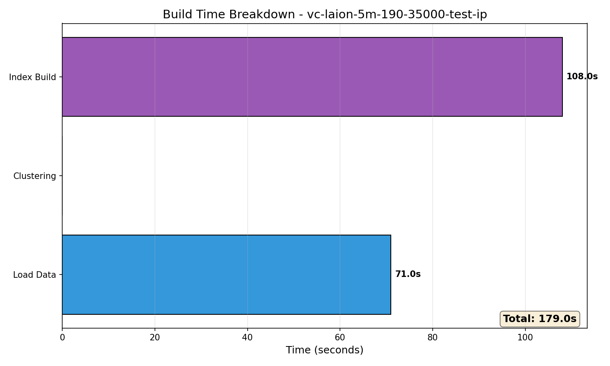
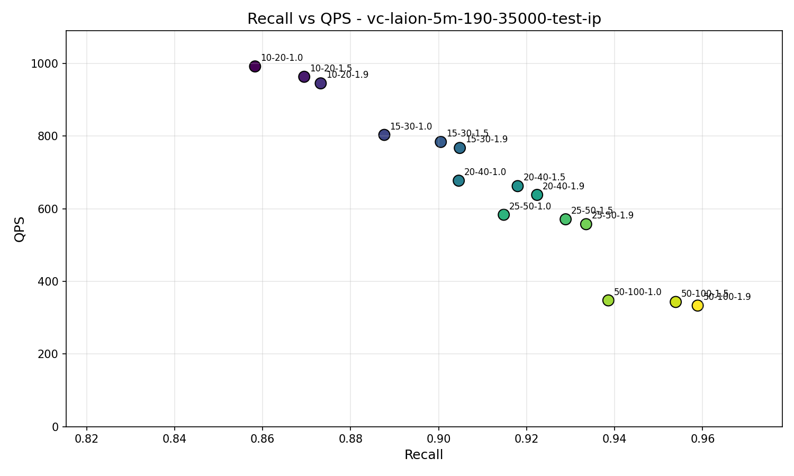
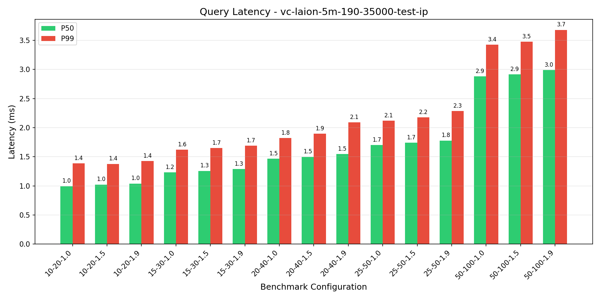
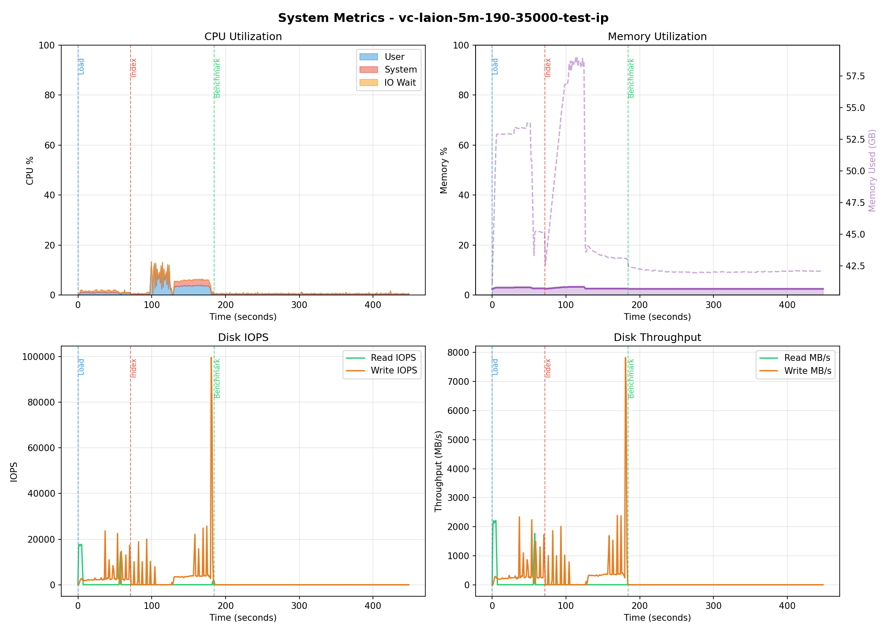

# Benchmark Report: vc-laion-5m-190-35000-test-ip

**Generated:** 2026-01-29 11:02:09
**Host:** hot-ready-ubuntu-rxt6000-1-dtpm-gpu01
**Suite Type:** vectorchord

---

## Configuration

| Parameter             | Value            |
|-----------------------|------------------|
| Dataset               | laion-5m-test-ip |
| Metric                | dot              |
| PG Parallel Workers   | 32               |
| Query Clients         | 1                |
| Top-K                 | 10               |
| Lists                 | [190, 35000]     |
| Sampling Factor       | 256              |
| Residual Quantization | True             |
| Build Threads         | 32               |
| K-means Hierarchical  | True             |

---

## Build Metrics

| Metric           | Value |
|------------------|-------|
| Load Time        | 71s   |
| Index Build Time | 108s  |
| Index Size       | 21 GB |

---

## Benchmark Results

| nprob  | epsilon | Recall | QPS    | P50 (ms) | P99 (ms) |
|--------|---------|--------|--------|----------|----------|
| 10,20  | 1.0     | 0.8583 | 991.86 | 0.99     | 1.39     |
| 10,20  | 1.5     | 0.8694 | 963.37 | 1.02     | 1.38     |
| 10,20  | 1.9     | 0.8732 | 945.27 | 1.04     | 1.43     |
| 15,30  | 1.0     | 0.8877 | 803.33 | 1.23     | 1.62     |
| 15,30  | 1.5     | 0.9005 | 783.90 | 1.26     | 1.65     |
| 15,30  | 1.9     | 0.9048 | 767.35 | 1.29     | 1.69     |
| 20,40  | 1.0     | 0.9046 | 677.22 | 1.47     | 1.82     |
| 20,40  | 1.5     | 0.9180 | 662.27 | 1.50     | 1.89     |
| 20,40  | 1.9     | 0.9224 | 638.12 | 1.55     | 2.09     |
| 25,50  | 1.0     | 0.9148 | 583.40 | 1.70     | 2.12     |
| 25,50  | 1.5     | 0.9289 | 570.93 | 1.74     | 2.18     |
| 25,50  | 1.9     | 0.9335 | 557.44 | 1.78     | 2.29     |
| 50,100 | 1.0     | 0.9386 | 347.57 | 2.88     | 3.43     |
| 50,100 | 1.5     | 0.9539 | 343.25 | 2.91     | 3.48     |
| 50,100 | 1.9     | 0.9589 | 333.25 | 2.99     | 3.68     |

---

## Charts

### Recall vs QPS

### Query Latency

---

## System Metrics

**Monitoring Duration:** 448.3 seconds

### CPU

| Metric  | Value |
|---------|-------|
| Average | 1.9%  |
| Maximum | 13.6% |

### Memory

| Metric  | Value          |
|---------|----------------|
| Average | 2.6%           |
| Maximum | 3.3% (59.0 GB) |

### Disk IO

| Metric                | Read   | Write  |
|-----------------------|--------|--------|
| IOPS (avg)            | 272    | 1807   |
| IOPS (max)            | 17733  | 99588  |
| Throughput avg (MB/s) | 33.2   | 168.3  |
| Throughput max (MB/s) | 2216.5 | 7828.8 |

---

## PostgreSQL Configuration

Settings modified from defaults:

| Setting                          | Value          | Default                        | Source             |
|----------------------------------|----------------|--------------------------------|--------------------|
| autovacuum                       | off            | on                             | configuration file |
| shared_preload_libraries         | vchord         |                                | configuration file |
| client_min_messages              | debug1         | notice                         | configuration file |
| max_connections                  | 200            | 100                            | configuration file |
| jit                              | off            | on                             | configuration file |
| random_page_cost                 | 1.1            | 4                              | configuration file |
| log_filename                     | postgresql.log | postgresql-%Y-%m-%d_%H%M%S.log | configuration file |
| log_rotation_age                 | 0min           | 1440min                        | configuration file |
| logging_collector                | on             | off                            | configuration file |
| effective_io_concurrency         | 200            | 1                              | configuration file |
| max_parallel_maintenance_workers | 64             | 2                              | configuration file |
| max_parallel_workers             | 64             | 8                              | configuration file |
| max_worker_processes             | 64             | 8                              | configuration file |
| max_files_per_process            | 16384          | 1000                           | configuration file |
| max_wal_size                     | 307200MB       | 1024MB                         | configuration file |

## PostgreSQL Statistics

### Final State (after_benchmark)

| Metric                       | Value          |
|------------------------------|----------------|
| Cache Hit Ratio              | 85.02%         |
| Blocks Read                  | 6,186,940,360  |
| Blocks Hit                   | 35,115,433,699 |
| Temp Files                   | 0              |
| Deadlocks                    | 0              |
| Checkpoints (timed)          | 802            |
| Checkpoints (requested)      | 65             |
| Buffers Written (checkpoint) | 552,731        |

### Activity by Phase

| Phase           | Blocks Read | Blocks Hit | Transactions | Checkpoints |
|-----------------|-------------|------------|--------------|-------------|
| Index Building  | 12,758,355  | 99,280,859 | 329          | 1           |
| Query Benchmark | 67,163,226  | 31,152,566 | 150,166      | 0           |

### Total Changes

| Metric                | Value       |
|-----------------------|-------------|
| Blocks Read           | 79,921,581  |
| Blocks Hit            | 130,433,425 |
| Transactions          | 150,495     |
| Rows Inserted         | 5           |
| Checkpoints           | 1           |
| Checkpoint Write Time | 179 ms      |
